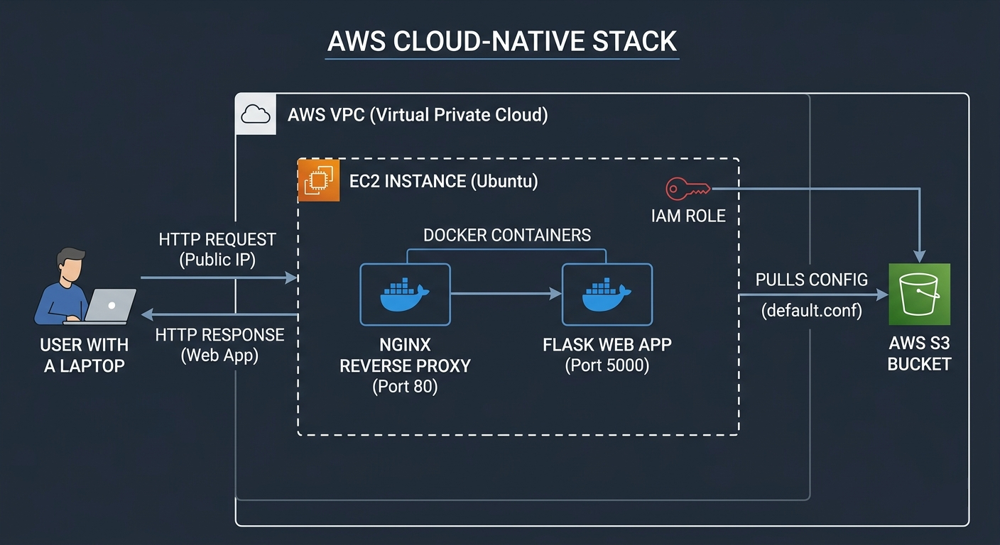

# ☁️ AWS Cloud-Native Automated Stack



### **Architecting Scalable Infrastructure with Nginx, Docker & AWS**

## 📌 Project Overview

This project demonstrates a professional **DevOps workflow** by deploying a containerized Flask application behind an Nginx Reverse Proxy on **AWS EC2**. The core focus is on **Security**, **Infrastructure as Code concepts**, and **Cloud Automation**, utilizing AWS-native features for secure configuration management.

---

## 🏗️ Architecture & Features

* **Reverse Proxy:** Nginx handles incoming traffic and routes it to the application.
* **Containerization:** Multi-container setup managed by **Docker Compose**.
* **Zero-Credential Security:** The EC2 instance uses an **IAM Role** to securely fetch configurations from S3, avoiding dangerous hardcoded AWS Access Keys.
* **Config Management:** AWS S3 acts as a centralized store for production-ready Nginx configurations.
* **Automated Provisioning:** A custom Bash script (`setup.sh`) handles dependencies, pulls cloud configs, and launches the stack.

---

## 📂 Repository Structure

```text
.
├── app/                   # Flask Web Application
│   ├── app.py             # Main Logic
|   ├── requirements.txt   # Python Dependencies
│   └── Dockerfile         # Optimized Python Image
├── nginx/                 # Proxy Configuration
│   └── default.conf       # Custom Nginx Rules
├── scripts/               # DevOps Automation
│   └── setup.sh           # One-click Cloud Provisioning
└── docker-compose.yml     # Container Orchestration
```

---

## 🛠️ Step-by-Step AWS Infrastructure Setup

To replicate this production-like environment, follow these precise steps in your AWS Console:

### 1. Network & S3 Storage
* **S3 Bucket Configuration:**
  * Created a private S3 bucket (e.g., `motorolas3`).
  * Uploaded the custom Nginx configuration file (`default.conf`) to this bucket.
* **Network & Security Group:**
  * Used a Default VPC (or a custom one).
  * Created a dedicated **Security Group** for the EC2 instance with the following **Inbound Rules**:
    * **SSH (Port 22):** Source `My IP` (For secure, restricted remote access).
    * **HTTP (Port 80):** Source `0.0.0.0/0` (To allow public web traffic to Nginx).

### 2. Identity and Access Management (IAM)
* **IAM Role Creation:**
  * Created an IAM Role for the **EC2** service.
  * Attached the AWS managed policy: **`AmazonS3ReadOnlyAccess`** (Granting the instance permission to pull configs from S3 securely).
  * Named the role `EC2-S3-ReadOnly-Role`.

### 3. Compute (EC2 Instance)
* **EC2 Deployment:**
  * Launched a new EC2 instance running Debian.
  * Attached the `EC2-S3-ReadOnly-Role` profile to the instance during launch (found under Advanced Details).
  * Captured the instance's **Public IPv4 Address** for remote access and testing.

---

## 🚀 How to Run & Deploy

Once you SSH into your EC2 instance and clone this repository, follow these steps to run the automation:

### 1. Give Execution Permissions to the Script
Linux requires explicit permissions to run shell scripts. Grant them using `chmod`:
```bash
chmod +x scripts/setup.sh
```

### 2. Run the Automated Setup
Execute the script. It will install Docker, pull the Nginx configuration from S3, and build the environment:
```bash
./scripts/setup.sh
```

### 3. Manual Fallback (Docker Compose)
If you ever need to manually spin up or rebuild the containers without the full script:
```bash
# To start the containers in the background
sudo DOCKER_BUILDKIT=0 COMPOSE_DOCKER_CLI_BUILD=0 docker-compose up --build -d

# To stop the containers and clean up
sudo docker-compose down
```

---

## 🧪 How to Test and Access the Web App

Once the containers are reported as `Started` by Docker Compose:

1. Open your web browser on your local machine.
2. In the URL bar, type the public IP of your EC2 instance using the HTTP protocol:
   ```text
   http://YOUR_EC2_PUBLIC_IP
   ```
   *(Note: Do not use `https://` as SSL certificates are not configured in this branch).*
3. You should see the response served by your Flask application through the Nginx Reverse Proxy!

To verify that everything is running correctly from inside the server terminal, you can run:
```bash
# Check running containers
sudo docker ps

# Test local endpoint
curl http://localhost:80
```
